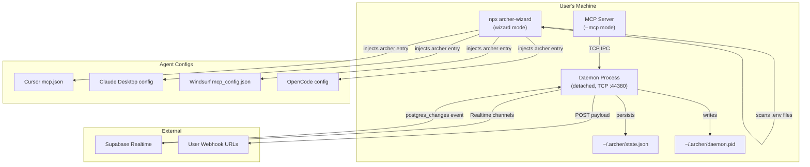
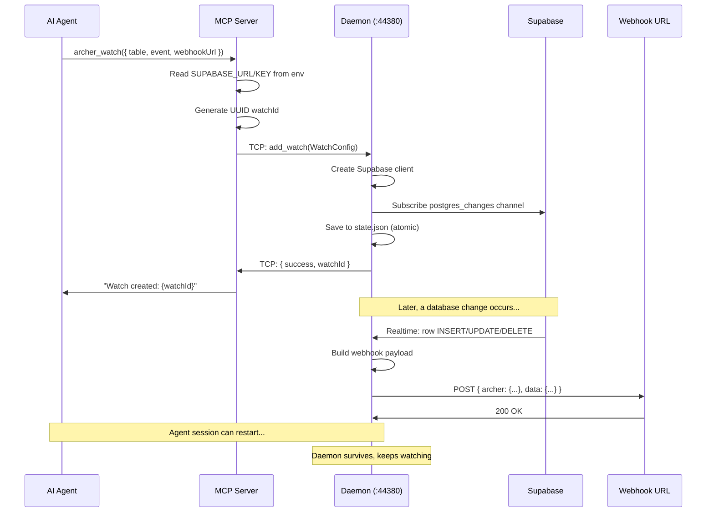

# Archer MCP — Complete Architecture Deep Dive

Archer is an **MCP server + persistent daemon** system that gives AI agents real-time event intelligence over Supabase databases. It operates in two modes: a **setup wizard** (interactive CLI) and an **MCP server** (stdio transport for AI agents), backed by a **TCP daemon** that holds Supabase Realtime channels independently of agent sessions.

---

## High-Level Architecture



---

## Entry Point — [index.ts](file:///Users/amirlankalmukhan/archer-mcp/src/index.ts)

The single entry point routes between two modes based on CLI flags:

| Flag | Mode | Function |
|---|---|---|
| `--mcp` | MCP Server | Starts stdio MCP server, auto-starts daemon via `ensureDaemon()` |
| *(none)* | Setup Wizard | Runs interactive `clack`-based CLI setup |
| `--daemon` | Daemon Process | Internal: starts the TCP daemon directly (used by lifecycle spawner) |

**MCP Server setup** registers 3 tools (`archer_watch`, `archer_unwatch`, `archer_watches`) on a `StdioServerTransport`, then calls `ensureDaemon()` to guarantee the background process is running.

---

## Module 1: Daemon (`src/daemon/`)

The daemon is the heart of Archer — a **detached Node.js process** that holds Supabase Realtime subscriptions and delivers webhooks, surviving agent session restarts.

### IPC Protocol — [types.ts](file:///Users/amirlankalmukhan/archer-mcp/src/daemon/types.ts)

Defines JSON-over-TCP protocol on `127.0.0.1:44380`:

```typescript
// Request types (MCP → Daemon)
type IpcRequestType = 'add_watch' | 'remove_watch' | 'list_watches' | 'ping';

// WatchConfig carries everything needed to subscribe
interface WatchConfig {
  id: string;            // UUID
  table: string;
  event: '*' | 'INSERT' | 'UPDATE' | 'DELETE';
  filter?: string;
  webhookUrl: string;
  supabaseUrl: string;   // per-watch credentials for multi-project
  supabaseKey: string;
  createdAt: string;     // ISO timestamp
}
```

Key constant: `ARCHER_DIR = ~/.archer` — stores `state.json` + `daemon.pid`.

### Persistent Store — [store.ts](file:///Users/amirlankalmukhan/archer-mcp/src/daemon/store.ts)

Implements **atomic JSON persistence** at `~/.archer/state.json`:

- `loadState()` — reads + parses, returns empty `{ watches: {} }` on failure
- `saveState()` — writes to temp file first, then `fs.renameSync` for atomicity (no partial writes)
- State shape: `{ watches: Record<string, WatchConfig> }`

### TCP Server & Channel Manager — [process.ts](file:///Users/amirlankalmukhan/archer-mcp/src/daemon/process.ts)

The main daemon loop (~190 lines). On startup:

1. Loads persisted state from `state.json`
2. **Reconnects all saved watches** — for each `WatchConfig`, creates a Supabase client + Realtime channel
3. Starts TCP server on port `44380`

**IPC request handling:**

| Request | Action |
|---|---|
| `add_watch` | Creates Supabase client, subscribes to `postgres_changes` channel, saves to state, begins delivering webhooks |
| `remove_watch` | Unsubscribes channel, removes from in-memory map + state file |
| `list_watches` | Returns all `WatchConfig` entries from state |
| `ping` | Returns `{ status: 'ok', watches: count }` |

**Channel subscription pattern:**
- Event `*` → subscribes to `INSERT`, `UPDATE`, `DELETE` separately
- Specific event → subscribes to just that one
- Filter support via Supabase's `filter` parameter on `postgres_changes`

**Webhook delivery** happens inline on each Realtime event — builds a payload with Archer metadata + the row data, then POSTs to the configured URL with retry logic (3 attempts, 2s delay).

### IPC Client — [client.ts](file:///Users/amirlankalmukhan/archer-mcp/src/daemon/client.ts)

Used by MCP tools to talk to the daemon:

```
Tool → sendIpcRequest() → TCP connect → JSON write → read response → parse
```

- `connectToDaemon()` — creates a `net.Socket`, connects to `127.0.0.1:44380`
- `sendIpcRequest()` — sends JSON line, reads response, returns parsed `IpcResponse`
- 5-second timeout on connections

### Lifecycle Manager — [lifecycle.ts](file:///Users/amirlankalmukhan/archer-mcp/src/daemon/lifecycle.ts)

Manages the daemon as a detached child process:

- `ensureDaemon()` — checks if daemon is already running (PID file + `ping`), spawns if not
- `startDaemon()` — `child_process.spawn` with `detached: true`, `stdio: 'ignore'`, saves PID file
- `stopDaemon()` — reads PID file, sends `SIGTERM`, removes PID file
- `isDaemonRunning()` — reads PID, sends `kill(pid, 0)` to check, falls back to TCP `ping`

Spawns: `node dist/daemon/run.js` as a fully detached process.

### Runner — [run.ts](file:///Users/amirlankalmukhan/archer-mcp/src/daemon/run.ts)

7-line entry point for the detached child process — just imports and calls `startDaemonProcess()`.

---

## Module 2: MCP Tools (`src/tools/`)

Three tools exposed via the Model Context Protocol:

### archer_watch — [watch.ts](file:///Users/amirlankalmukhan/archer-mcp/src/tools/watch.ts)

Creates a persistent real-time watch. Accepts:
- `table` (required) — Supabase table name
- `event` — `INSERT` | `UPDATE` | `DELETE` | `*` (default: `*`)
- `filter` — optional Supabase filter expression
- `webhookUrl` (required) — destination for event payloads

**Flow:** Reads `SUPABASE_URL` + `SUPABASE_SERVICE_ROLE_KEY` from env → generates UUID → builds `WatchConfig` → sends `add_watch` IPC to daemon → returns watch ID to agent.

### archer_unwatch — [unwatch.ts](file:///Users/amirlankalmukhan/archer-mcp/src/tools/unwatch.ts)

Removes a watch by ID. Sends `remove_watch` IPC to daemon.

### archer_watches — [watches.ts](file:///Users/amirlankalmukhan/archer-mcp/src/tools/watches.ts)

Lists all active watches. Sends `list_watches` IPC to daemon, formats response as a readable list showing table, event, filter, webhook URL, and creation time.

---

## Module 3: Setup Wizard (`src/wizard/`)

Interactive CLI that discovers credentials and injects Archer into AI agent configs.

### Orchestrator — [index.ts](file:///Users/amirlankalmukhan/archer-mcp/src/wizard/index.ts)

10-step `clack`-based flow:

1. Show ASCII art banner
2. Start clack intro
3. Scan project for Supabase credentials
4. Detect project framework (Next.js / Vite)
5. Prompt for any missing credentials
6. Detect installed AI agents
7. Inject Archer MCP config into agents
8. Filter successful injections
9. Inject agent rules (tool documentation)
10. Show success box

### Scanner — [scanner.ts](file:///Users/amirlankalmukhan/archer-mcp/src/wizard/scanner.ts)

Discovers Supabase credentials from the user's project:

**Env file priority:** `.env.local` > `.env` > `.env.development` > `.env.production`

**Key aliases searched:**
| Credential | Aliases |
|---|---|
| URL | `SUPABASE_URL`, `NEXT_PUBLIC_SUPABASE_URL`, `VITE_SUPABASE_URL` |
| Service Key | `SUPABASE_SERVICE_ROLE_KEY`, `SUPABASE_SERVICE_KEY` |
| Anon Key | `SUPABASE_ANON_KEY`, `NEXT_PUBLIC_SUPABASE_ANON_KEY`, `VITE_SUPABASE_ANON_KEY` |

Also **scans the entire codebase** (recursive file search, skipping `node_modules` and hidden dirs) for hardcoded credential patterns as a fallback.

`promptForMissing()` — interactive prompts with Zod validation for any credentials not found.

### Detector — [detector.ts](file:///Users/amirlankalmukhan/archer-mcp/src/wizard/detector.ts)

Discovers installed AI agents by checking platform-specific config paths:

| Agent | macOS Config Path |
|---|---|
| Cursor | `~/.cursor/mcp.json` |
| Claude Code | `~/Library/Application Support/Claude/claude_desktop_config.json` |
| OpenCode | `~/.config/opencode/opencode.json` |
| Antigravity | `~/.config/antigravity/config.json` |
| Windsurf | `~/.codeium/windsurf/mcp_config.json` |

Cross-platform: has `darwin`, `linux`, `win32` paths for each agent.

An agent is considered "installed" if its config file or parent directory exists.

### Injector — [injector.ts](file:///Users/amirlankalmukhan/archer-mcp/src/wizard/injector.ts)

Writes Archer's MCP server entry into each agent's config JSON:

```json
// Standard format (Cursor, Claude, Windsurf, Antigravity)
{ "command": "npx", "args": ["-y", "archer-wizard@latest", "--mcp"], 
  "env": { "SUPABASE_URL": "...", "SUPABASE_SERVICE_ROLE_KEY": "..." } }

// OpenCode format
{ "type": "local", "command": ["npx", "-y", "archer-wizard@latest", "--mcp"],
  "environment": { ... } }
```

Reads existing config, merges without overwriting other MCP servers, writes back.

### Rules — [rules.ts](file:///Users/amirlankalmukhan/archer-mcp/src/wizard/rules.ts)

Injects a **markdown documentation block** into each agent's rules file so the agent knows about Archer's tools. Uses `<!-- archer:start -->` / `<!-- archer:end -->` comment markers for idempotent updates.

Content includes: tool descriptions, parameter docs, usage examples, trigger words ("watch", "monitor", "alert me", etc.).

---

## Module 4: Shared Libraries (`src/lib/`)

### ascii.ts — [ascii.ts](file:///Users/amirlankalmukhan/archer-mcp/src/lib/ascii.ts)

Terminal UI utilities:
- `showAsciiArt()` — green block-character ARCHER banner
- Status loggers: `logAction` (◆ blue), `logSuccess` (✓ green), `logError` (✗ red), `logProgress` (● white), `logReady` (▶ green)
- `maskCredential()` — shows first 3-8 chars + `******`
- `showSuccessBox()` — bordered box with setup summary
- `stderr*` variants — for MCP mode (stdout is reserved for JSON-RPC)

### supabase.ts — [supabase.ts](file:///Users/amirlankalmukhan/archer-mcp/src/lib/supabase.ts)

Supabase client factory + channel helpers:
- Singleton client from `SUPABASE_URL` + `SUPABASE_SERVICE_ROLE_KEY` env vars
- `createAuthChannel()` — listens to `auth.users` INSERT events
- `createTableChannel()` — listens to arbitrary table events in `public` schema
- `removeChannel()` — cleanup helper

### webhook.ts — [webhook.ts](file:///Users/amirlankalmukhan/archer-mcp/src/lib/webhook.ts)

HTTP webhook delivery with retry:
- 3 attempts, 2-second delay between retries
- Headers: `Content-Type: application/json`, `User-Agent: Archer/0.1.0`, `X-Archer-Event: <event>`
- `buildWebhookPayload()` — wraps data in `{ archer: { watchId, event, source, firedAt }, data }`

---

## Module 5: Type System (`src/types/index.ts`)

All shared types in one file, Zod-validated where applicable:

| Type | Purpose |
|---|---|
| `Framework` | `'nextjs' \| 'vite' \| 'unknown'` |
| `ScanResult` | Scanner output: credentials, framework, source file |
| `AgentInfo` | Detected agent: name, install status, config path |
| `WatchEvent` | Zod enum: `auth.signup`, `table.insert/update/delete` |
| `WatchInput` | Zod schema with refinement: table required for non-auth events |
| `WatchResult` | Tool response: success, watchId, message |
| `WebhookPayload` | Structured payload with archer metadata + data |
| `PostgresEvent` | `'INSERT' \| 'UPDATE' \| 'DELETE'` |
| `InjectionResult` | Agent injection outcome |

---

## Data Flow: End-to-End Watch Lifecycle



---

## Key Design Decisions

| Decision | Rationale |
|---|---|
| **TCP IPC over Unix sockets** | Cross-platform (macOS, Linux, Windows) |
| **JSON lines protocol** | Simple, debuggable, no binary framing |
| **Detached daemon process** | Survives parent MCP server lifecycle |
| **Per-watch credentials** | Multi-project Supabase support |
| **Atomic state writes** | Temp file + rename prevents corruption |
| **Auto-start daemon** | `ensureDaemon()` on MCP boot — zero friction |
| **Agent-aware config injection** | Different JSON shapes for OpenCode vs others |
| **Idempotent rules injection** | HTML comment markers for safe re-runs |
| **Env file priority chain** | `.env.local` wins over `.env` — matches Next.js convention |
| **Codebase-wide credential scan** | Fallback when env files are missing |

---

## File Map (17 source files)

```
src/
├── index.ts            ← Entry point: --mcp / --daemon / wizard
├── daemon/
│   ├── types.ts        ← IPC protocol, WatchConfig, constants
│   ├── store.ts        ← Atomic JSON persistence (~/.archer/state.json)
│   ├── process.ts      ← TCP server, Supabase channels, webhook delivery
│   ├── client.ts       ← IPC client (tools → daemon)
│   ├── lifecycle.ts    ← Start/stop/ensure daemon, PID management
│   └── run.ts          ← Detached process entry point
├── tools/
│   ├── watch.ts        ← archer_watch tool
│   ├── unwatch.ts      ← archer_unwatch tool
│   └── watches.ts      ← archer_watches tool
├── wizard/
│   ├── index.ts        ← 10-step clack CLI orchestrator
│   ├── scanner.ts      ← Credential discovery (env files + codebase)
│   ├── detector.ts     ← AI agent detection (5 agents, 3 platforms)
│   ├── injector.ts     ← MCP config injection
│   └── rules.ts        ← Agent rules/docs injection
├── lib/
│   ├── ascii.ts        ← Terminal UI (banner, loggers, stderr)
│   ├── supabase.ts     ← Client factory + channel helpers
│   └── webhook.ts      ← HTTP delivery with retry
└── types/
    └── index.ts        ← All shared types + Zod schemas
```

## Verification

- ✅ TypeScript build (`npm run build`) — zero errors
- ✅ All source files compiled to `dist/`
- ✅ IPC protocol uses JSON-over-TCP on `127.0.0.1:44380`
- ✅ State persists to `~/.archer/state.json` with atomic writes
- ✅ 5 AI agents supported across 3 platforms (macOS/Linux/Windows)
